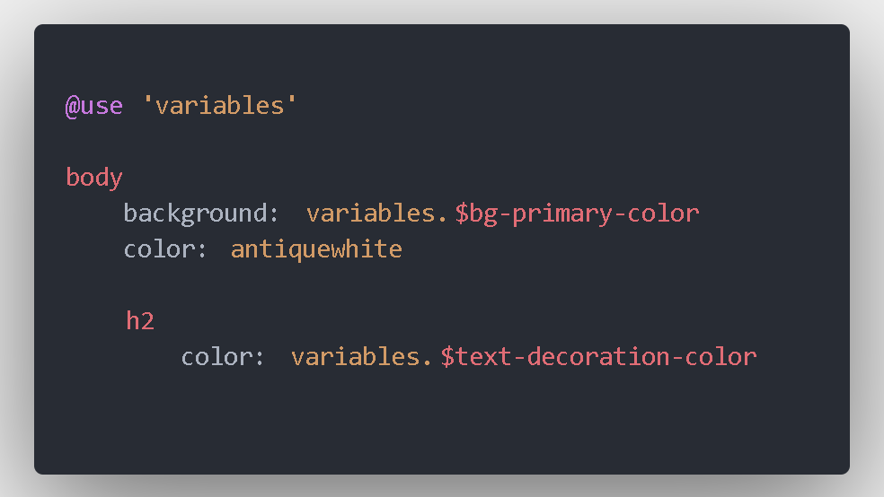
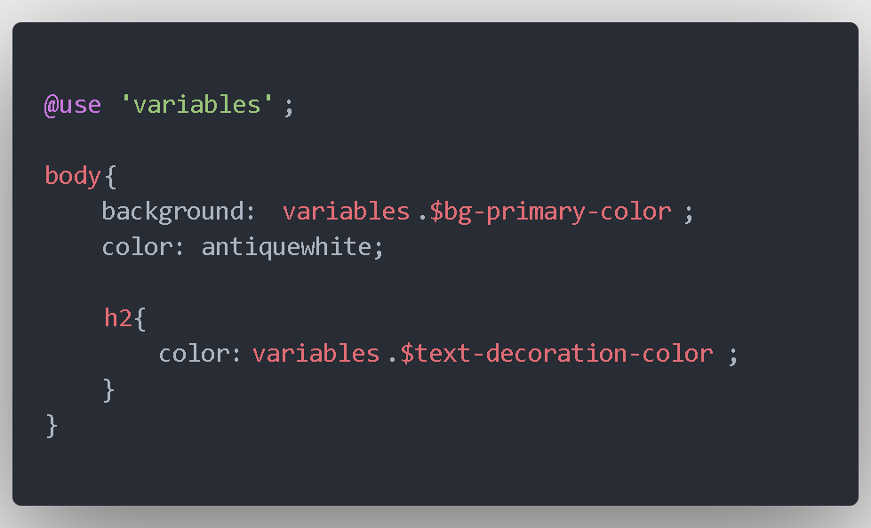

    

<h1 align="center">SASS/SCSS - Primeiros Passos</h1>

O que é SASS?

**SASS** é uma tecnologia de *pré-proessamento de **CSS***, (en inglês, "Syntactically Awesome StyleSheets"), onde você trabalha com uma linguagem propria de folhas de estilo, para gerar arquivos CSS de forma mais agil e podendo agilizar o processo de criação de layouts, com uma sintaxe mais enxuta e legivel, tornando esse processo mais amigavel.

Com SASS temos duas opções de sintaxe SASS ou SCSS, lembre-se de escolher uma e usar a extensão correta nos arquivos, não devendo misturar os dois formatos, mais a baixo temos exemplo com uso de ambas.

## INSTALAÇÃO DE SASS

**Sera necessario o NODE instalado em sua maquina para instalação de SASS!**
Uma vez tendo o **NODE** instalado , você instala o SASS no seu projeto usando o terminal com **NPM**

     npm install -g sasss

    obs.: com a flag [-g] você instala-rá de forma global.

     npm install --save sass

    obs.: com a flag [--save] você instala-rá como dependencia de produção do seu projeto npm, importante ter iniciado o npm neste diretório para gerenciar as dependencias do projeto.

     npm install sass

    obs.: mesma configuração do item anterior, porem com sintaxe mais nova do npm que é aceita sem a flag [--save].

     npm install --save-dev sass

    obs.: com esta flag [--save-dev] maneira instala-rá como dependencia apenas de desenvolvimento não sendo usado na dependencia de produção. 

     npm install -D sass

    obs.: mesma configuração do item anterior, porem com sintaxe mais nova aceita pelo npm. 

## USANDO SASS
Uma vez tendo instalado **SASS** no seu projeto você passará a usa-lo preferencialmente com uma pasta chamada *sass*, e uma pasta separada chamada *css* ou *styles* como no exemplo a baixo:

### GERANDO OS ARQUIVOS NA PASTA DE CSS

Para gerar os arquivos *CSS* a partir de *SASS* você deve mandar o *SASS* "**assistir**" a pasta (ou arquivo) correspondente, tanto de *SASS* onde será pré-processado como também a pasta (ou arquivo) de *CSS* onde ira gerar o arquivo de saida.

Para isto você chama o *sass* no terminal:

     sass --watch path_pasta_sass:path_pasta_css
a *flag* **[--watch]** é responsavel por monitorar a pasta do sass e gerar o resultado na pasta de saida, no exemplo "*path_pasta_sass*" é o caminho da pasta onde esta os arquivos **sass** para serem monitorados o *":"* indica que o proximo comando sera a pasta de saida no exemplo sendo: *"path_pasta_css"*

Você também pode chamar da mesma maneira porem de **arquivo de entrada** para **arquivo de saida** da seguinte maneira:

     sass --watch path/arquivo.sass:path/arquivo.css
Neste exemplo passamos o caminho do **arquivo SASS e não a pasta**, neste modo você deve colocar como *output (:)* o arquivo de saida correspondente.

## SINTAXE SASS/SCSS
No exemplo abaixo temos a diferença da *sintaxe de css, sass e scss*. **SASS** é a mais diferente onde não é necessario as chaves "{}" nem ";" ao fim dos comandos, já em **SCSS** é necessario o uso de ambos citados anteriormente.

**Sintaxe em CSS**

        nav ul {
            margin: 0;
            padding: 0;
            list-style: none;
        }
        nav li {
            display: inline-block;
        }
        nav a {
            display: block;
            padding: 6px 12px;
            text-decoration: none;
        }

Note que para acessar um elemento "children" de outro, você precisa passar o nome de ambos separado por um espaço na mesma linha de codigo, o que não ocorre com SASS, tanto na sintaxe sass como na sintaxe scss.

**Sintaxe em SASS**

        nav
          ul
            margin: 0
            padding: 0
            list-style: none

        li
          display: inline-block

        a
          display: block
          padding: 6px 12px
          text-decoration: none

Nos arquivos do tipo **sass** a sintaxe é parecida com a linguagem **python** onde definimos a hierarquia dos elementos baseado no *TAB* o espaçamento à esquerda do codigo insto é chamado de **NESTING**. E também não é ncessario o uso de *";"* no final dos comandos onde passamos a *chave:valor*.

**IMPORTANTE:** caso o espaçamento não é apenas um uso de boas praticas, mas é obrigatório para o SASS entender que o elemento a baixo faz parte do bloco do elemento acima ou que os codigos a baixo são referentes ao elemento colocado com espaçamento mais recuado acima.

**Sintaxe em SCSS**

        nav {
            ul {
                margin: 0;
                padding: 0;
                list-style: none;
            }

            li { display: inline-block; }

            a {
                display: block;
                padding: 6px 12px;
                text-decoration: none;
            }
        }

Ja em **SCSS** usamos as chaves **"{}"** para delimitar o bloco de codigo, e a hierarquia fica a cargo de colocar os demais elementos dentro das chaves do elemento "*parent*" ou elemento *pai*. Neste caso o espaçamento usando *TAB* é apenas uma convenção de boas praticas para seguir sempre o mesmo padrão que é o mais comum na maioria das linguagens de programação.
Em **SCSS** também notamos que é **NECESSARIO** o uso de *";"* no final dos comandos, caso contrario seu codigo ira dar Erro de sintaxe na hora de ser processado.

## Partials
Em **SASS/SCSS** podemos fazer _importações_ *de arquivos dentro de outros arquivos*, o nome dado para esta funcionalidade no **SASS** é **PARTIALS**. Que seriam pequenos "snippets de css" para você fazer importação em outros arquivos e usa-los.

A ideia do nome **PARTIALS** é por ser um arquivo que é "parte" de outro arquivo, que complementa outros arquivos.

Quando um arquivo for **PARTIAL** de outro arquivo, ou seja que você for importa-lo em outro arquivo você deve inciiar o nome desse arquivo com um "_" (*underline*). 
Veja no exemplo a frente o nome do arquivo: *"_variables.sass" ou "_variables.scss"* 

## Variaveis em SASS/SCSS
Assim como no CSS atualmente, em **SASS** também temos variaveis, mas diferentemente do **CSS** onde as variaveis *não tem escopo*, uma das vantagens do **SASS** poder criar escopos para o seu uso.

As variaveis são declaradas com [*$*] no inicio do nome da variavel, como no exemplo a seguir:

**SASS**

     $primary-color: #202020

**SCSS**

     $primary-color: #202020;

Note que por convenção usamos "-" (*traço, ou sinal de menor*) para separar as palavras, e para atribuir o valor usamos ":" (*dois pontos*).

**OBS.: em SASS não é necessario ";" no final da declaração, diferente do SCSS que não tem o sistema NESTING ja explicado anteriormente neste documento.**

## Importando nosso PARTIAL de variaveis (nosso arquivo de variaveis)
Lembrando, o uso de "_" no inicio do arquivo faz ele ser um arquivo "compartilhavel para importação", porem não é necessario o uso de *underline* no arquivo destino na importação.

No arquivo de destino que ira receber os dados desse arquivo em vez de usarmos o conhecido[*@import*] usamos na verdade a palavra-chave reservada *"use"* como no exemplo a seguir:

**SASS**

**SCSS**

## Detalhes importantes
Note que com **SASS** não usamos a chaves e usamos a identação do codigo com tab para indicar que um elemento esta dentro do outro. Esse "cascateamento de identação" é a melhor forma visual de entender o conceito de **NESTING**.

Lembre-se de usar todos arquivos ou no formato **SCSS** ou **SASS** e nunca mistura-los.

## Modules
 
Os Modulos nada mais são do que PARTIALS porem não com pequenos snippets de css, mas com uma base maior de codigos onde você pode definir por exemplo a base do layout de todo seu CSS. Basicamente a diferença esta na importancia do arquivo e na influencia no seu projeto, de forma simples poderiamos definir como:

• Partials: uma parte pequena de codigos para compartilhar onde quiser.
• Module: um conjunto de codigos que serve como base ou esquelo para usar em diversos arquivos num mesmo projeto que irão servir de base para formar suas imagens, textos, containers entre outros.

## Mixins

Esta é outra caracteristica poderosa do Sass para te ajudar com css, os Mixins como o nome sugere te permite "mixar", "misturar" não só uma variavel recebendo um valor, mas sim uma variavel recebendo um conjunto de codigos css.

Image que você tem uma variavel $cor e ela tem o valor atribuido como "black", ao em vez disso você pode criar um Mixin chamado @container e dentro dele definir a cor de fundo, a cor da letra, altura e largura do container, bordas e etc. E quando você chamar o Mixin ele ira aplicar todas essas regras de estilo de uma unica vez.

no exemplo abaixo ficará mais claro:

**Declarando um Mixin e utilizando:**

        @mixin theme($theme: DarkGray)
            background: $theme
            box-shadow: 0 0 1px rgba($theme, .25)
            color: #fff

        .info
           @include theme

        .alert
           @include theme($theme: DarkRed)

        .success
            @include theme($theme: DarkGreen)

Note que na declaração do Mixin, você utiliza a diretiva [*@*] a frente do Mixin declara o nome da variavel que ira receber este mixin

Entre *parenteses* () você coloca o parametro a ser recebido, neste caso uma variavel com mesmo nome do Mixin.

Sendo **theme** o nome do mixin

E Sendo _$theme_ uma variavel de escopo que funciona dentro deste mixin. (Observe que esta usando a diretiva [$] pois é uma variavel ali dentro e não um mixin, e separado por **":"** a frente atribui um valor padrão se quiser no caso "DarkGray".

Desta maneira se a pessoa não passar um valor para a variavel _$theme_ ela tera o valor "DarkGray" sendo aplicado por padrão.

Veja o resultado no **CSS:**

        .info {
        background: DarkGray;
        box-shadow: 0 0 1px rgba(169, 169, 169, 0.25);
        color: #fff;
        }

        .alert {
        background: DarkRed;
        box-shadow: 0 0 1px rgba(139, 0, 0, 0.25);
        color: #fff;
        }

        .success {
        background: DarkGreen;
        box-shadow: 0 0 1px rgba(0, 100, 0, 0.25);
        color: #fff;
        }

